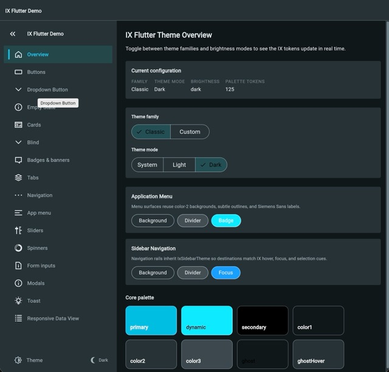

# ix_flutter

[](https://github.com/SobSoft-s-r-o/ix_flutter/actions/workflows/ci.yml)
[](https://github.com/SobSoft-s-r-o/ix_flutter/actions/workflows/version-bump.yml)
[](https://pub.dev/packages/ix_flutter)
[](https://flutter.dev)
[](https://dart.dev)
[](LICENSE)

A comprehensive Flutter component library based on the Siemens iX Design System.

> ⚠️ **Important Disclaimer**: This is an **independent, community-maintained** adaptation of the Siemens iX Design System for Flutter. It is **NOT** developed, maintained, or endorsed by Siemens AG. See [LICENSE](LICENSE), [ICON_LICENSING.md](ICON_LICENSING.md), and [THIRD_PARTY_NOTICES.md](THIRD_PARTY_NOTICES.md) for complete legal information.

## Screenshots



*IX Flutter demo application showcasing components in dark theme*

## Overview

`ix_flutter` provides Flutter widgets and components that implement the Siemens iX Design System, enabling developers to build consistent, professional applications that follow Siemens design guidelines.

This package brings the design patterns, components, and visual language from [Siemens iX](https://ix.siemens.io) to Flutter applications.

## Features

- 🎨 **Siemens iX Theme System** - Complete theming support with light/dark modes
- 🧩 **UI Components** - Pre-built widgets following iX design patterns
- 🎯 **1400+ Icons** - Access to the complete Siemens iX icon library
- 📱 **Responsive Design** - Components adapt to different screen sizes
- ♿ **Accessibility** - Built with accessibility in mind

## Important: Using Siemens iX Icons

**⚠️ Due to licensing and distribution restrictions, icon SVG files are NOT included in this library package.**

To use Siemens iX icons, you **MUST** run the icon generator tool to download icons from the official Siemens source.

### Quick Icon Setup

1. Add the packages to your `pubspec.yaml`:

```yaml
dependencies:
  ix_flutter: ^1.0.2

dev_dependencies:
  ix_icons_generator: ^1.0.0
```

2. Get dependencies:

```bash
flutter pub get
```

3. Generate icons:

```bash
dart run ix_icons_generator:generate_icons
```

4. Use icons in your code:

```dart
import 'package:your_app/ix_icons.dart';

Widget build(BuildContext context) {
  return IxIcons.home;
}
```

**See [doc/ix_icons.md](doc/ix_icons.md) for complete icon documentation.**

## Installation

Add this to your package's `pubspec.yaml` file:

```yaml
dependencies:
  ix_flutter: ^1.0.2
```

Then run:

```bash
flutter pub get
```

## Getting Started

### 1. Build Your Theme with IxThemeBuilder

```dart
import 'package:flutter/material.dart';
import 'package:ix_flutter/ix_flutter.dart';

void main() {
  // Build Siemens iX themes
  final lightTheme = const IxThemeBuilder(mode: ThemeMode.light).build();
  final darkTheme = const IxThemeBuilder(mode: ThemeMode.dark).build();

  runApp(MyApp(lightTheme: lightTheme, darkTheme: darkTheme));
}

class MyApp extends StatelessWidget {
  const MyApp({
    super.key,
    required this.lightTheme,
    required this.darkTheme,
  });

  final ThemeData lightTheme;
  final ThemeData darkTheme;

  @override
  Widget build(BuildContext context) {
    return MaterialApp(
      title: 'Siemens iX Demo',
      theme: lightTheme,
      darkTheme: darkTheme,
      themeMode: ThemeMode.system,
      home: const HomeScreen(),
    );
  }
}
```

### 2. Use iX Components

```dart
import 'package:ix_flutter/ix_flutter.dart';
import 'package:your_app/ix_icons.dart';  // Generated icons

class HomeScreen extends StatelessWidget {
  @override
  Widget build(BuildContext context) {
    return Scaffold(
      appBar: AppBar(
        title: Text('My App'),
        leading: IxIcons.menu,
      ),
      body: Column(
        children: [
          IxButton.primary(
            onPressed: () {},
            child: Text('Primary Action'),
          ),
          IxButton.secondary(
            onPressed: () {},
            child: Text('Secondary Action'),
          ),
        ],
      ),
    );
  }
}
```

## Available Components

- **Buttons**: Primary, secondary, ghost, icon buttons
- **Application Scaffold**: Complete app structure with navigation
- **Dropdown**: Dropdown buttons and menus
- **Empty State**: Placeholder components for empty data
- **Toast Notifications**: Temporary notifications and alerts
- **Blind/Drawer**: Sliding panels and drawers
- **Responsive Data View**: Responsive tables and data grids
- **Theme System**: Complete theming with color tokens

## Documentation

- **[Icons Documentation](doc/ix_icons.md)** - Complete guide for using Siemens iX icons
- **[Application Scaffold](doc/ix_application_scaffold.md)** - App structure and navigation
- **[Blind/Drawer](doc/ix_blind.md)** - Sliding panel documentation
- **[Breadcrumb](doc/ix_breadcrumb.md)** - Hierarchical navigation breadcrumb
- **[Dropdown Button](doc/ix_dropdown_button.md)** - Dropdown component guide
- **[Empty State](doc/ix_empty_state.md)** - Empty state placeholder docs
- **[Responsive Data View](doc/ix_responsive_data_view.md)** - Data table documentation
- **[Spinner](doc/ix_spinner.md)** - Animated loading spinner component
- **[Toast](doc/ix_toast.md)** - Notification system docs
- **[Colors](doc/copilot_colors.md)** - Color token reference

## Example

Check out the [example](example/) directory for a complete working application demonstrating all components.

To run the example:

```bash
cd example
flutter pub get

# Generate icons (required first time)
dart run ix_icons_generator:generate_icons

flutter run
```

## Icon Generator Tool

The icon generator is integrated with this package and downloads Siemens iX icons from the official source.

### Why Generator is Required

Due to licensing and distribution restrictions on Siemens iX Design System icons, SVG files cannot be bundled in the library. The generator ensures:

- ✅ Legal compliance with Siemens licensing
- ✅ Icons are from the official `@siemens/ix-icons` source
- ✅ Latest icon versions available
- ✅ Proper attribution and licensing

### Generator Usage

```bash
# Basic usage
dart run ix_icons_generator:generate_icons

# Custom paths
dart run ix_icons_generator:generate_icons \
  --output lib/generated \
  --assets assets/icons

# For library packages
dart run ix_icons_generator:generate_icons \
  --package my_library_name

# Show help
dart run ix_icons_generator:generate_icons --help
```

See [tool/README.md](tool/README.md) for complete generator documentation.

## Platform Support

| Platform | Supported |
|----------|-----------|
| Android  | ✅         |
| iOS      | ✅         |
| Web      | ✅         |
| macOS    | ✅         |
| Windows  | ✅         |
| Linux    | ✅         |

## Requirements

- Flutter SDK: >=3.10.0
- Dart SDK: >=3.10.0

## License

This package is licensed under the MIT License. See [LICENSE](LICENSE) file for details.

## Important Legal Notice

### Trademark and Attribution

- **Siemens iX Design System** is owned and maintained by Siemens AG
- This package is an **independent community adaptation**, not an official Siemens product
- Not developed, maintained, or endorsed by Siemens
- Siemens® and Siemens iX™ are trademarks of Siemens AG

For official Siemens iX resources, visit: https://ix.siemens.io

### Icon Licensing

The Siemens iX icons are subject to Siemens' licensing terms. This library does NOT include the icon files due to distribution restrictions. Users must:

1. Download icons using the provided generator tool
2. Icons are sourced from the official `@siemens/ix-icons` npm package
3. Ensure compliance with Siemens iX Design System licensing terms

**By using the icon generator, you agree to comply with Siemens iX Design System licensing terms.**

### Icon Licensing Details

See [ICON_LICENSING.md](ICON_LICENSING.md) for complete licensing information.

## Documentation

Complete documentation is available in the [doc/](doc/) folder:

- **[Icon Integration Guide](doc/ix_icons.md)** - Complete guide to using Siemens iX icons
- **[Application Scaffold](doc/ix_application_scaffold.md)** - Main application container component
- **[Blind/Drawer](doc/ix_blind.md)** - Sliding panel component
- **[Dropdown Button](doc/ix_dropdown_button.md)** - Dropdown selection component  
- **[Empty State](doc/ix_empty_state.md)** - Empty state placeholder component
- **[Responsive Data View](doc/ix_responsive_data_view.md)** - Responsive data table component
- **[Toast Notifications](doc/ix_toast.md)** - Notification system component
- **[Color Tokens](doc/copilot_colors.md)** - Color system reference

## Quick Start Example

```dart
import 'package:flutter/material.dart';
import 'package:ix_flutter/ix_flutter.dart';

void main() {
  // Build Siemens iX themes
  final lightTheme = const IxThemeBuilder(mode: ThemeMode.light).build();
  final darkTheme = const IxThemeBuilder(mode: ThemeMode.dark).build();

  runApp(MyApp(lightTheme: lightTheme, darkTheme: darkTheme));
}

class MyApp extends StatelessWidget {
  const MyApp({
    super.key,
    required this.lightTheme,
    required this.darkTheme,
  });

  final ThemeData lightTheme;
  final ThemeData darkTheme;

  @override
  Widget build(BuildContext context) {
    return MaterialApp(
      title: 'ix_flutter Demo',
      theme: lightTheme,
      darkTheme: darkTheme,
      themeMode: ThemeMode.system,
      home: Scaffold(
        appBar: AppBar(title: const Text('ix_flutter Components')),
        body: const Center(
          child: Text('Build beautiful apps with ix_flutter'),
        ),
      ),
    );
  }
}
```

## Available Components

- **IxApplicationScaffold** - Main application shell with sidebar navigation
- **IxBreadcrumb** - Navigation breadcrumb component
- **IxBlind** - Sliding drawer/panel component
- **IxDropdownButton** - Advanced dropdown selection
- **IxEmptyState** - Empty state with icon and message
- **IxResponsiveDataView** - Responsive data table/list
- **IxToast** - Toast notification system
- **IxPaginationBar** - Pagination controls
- **And many more...**

See [example/](example/) folder for complete working examples.

## Contributing

Contributions are welcome! Please follow these guidelines:

1. Fork the repository
2. Create a feature branch (`git checkout -b feature/AmazingFeature`)
3. Commit your changes (`git commit -m 'Add AmazingFeature'`)
4. Push to the branch (`git push origin feature/AmazingFeature`)
5. Open a Pull Request

### Development Setup

```bash
# Clone repository
git clone https://github.com/SobSoft-s-r-o/ix_flutter.git
cd ix_flutter

# Install dependencies
flutter pub get

# Run tests
flutter test

# Generate icons for development
dart run ix_icons_generator:generate_icons

# Run example app
cd example
flutter run
```

## Resources

### Official Siemens iX Design System
- **Website**: https://ix.siemens.io
- **Documentation**: https://ix.siemens.io/docs/
- **Icon Library**: https://ix.siemens.io/docs/icon-library/
- **Design Guidelines**: https://ix.siemens.io/docs/guidelines/

### This Package
- **Icon Licensing**: See [ICON_LICENSING.md](ICON_LICENSING.md)
- **License**: See [LICENSE](LICENSE)
- **Example App**: See [example/](example/) folder

## Changelog

See [CHANGELOG.md](CHANGELOG.md) for version history and updates.

## Support

- **Documentation**: Check [doc/](doc/) folder for detailed component guides
- **Issues**: [Report a bug](https://github.com/SobSoft-s-r-o/ix_flutter/issues)
- **Discussions**: [Ask a question](https://github.com/SobSoft-s-r-o/ix_flutter/discussions)
- **Maintainer**: SobSoft (https://sobsoft.sk)

### Sponsorship

Support the development of this package! ❤️

[](https://github.com/sponsors/SobSoft-s-r-o)

Your sponsorship helps maintain and improve ix_flutter. [Become a sponsor](https://github.com/sponsors/SobSoft-s-r-o) or use the **Sponsor** button at the top of the repository.

### Commercial Support

For paid support, consulting, or custom development services, contact SobSoft:

📧 **[Contact Form](https://sobsoft.sk/en/contact)**

We offer professional services including:
- Custom component development
- Migration assistance
- Integration support
- Training and consulting

## License

This package is licensed under the MIT License. See [LICENSE](LICENSE) for details.

**Important**: Icons and design patterns are subject to separate licensing terms. See [ICON_LICENSING.md](ICON_LICENSING.md) for details.

---

**Community Project Notice**: This package is maintained by the community and is not affiliated with Siemens. For official Siemens iX resources, visit https://ix.siemens.io

**Version**: 1.0.0 | **Dart**: >=3.10.0 | **Flutter**: >=3.10.0

**Disclaimer**: This is not an official Siemens product. This library is developed independently and provides Flutter implementations of Siemens iX Design System patterns. Always ensure compliance with Siemens licensing terms when using iX design assets.

---

Developed by [SobSoft](https://sobsoft.sk) – Industrial HMI & Enterprise Software Engineering
