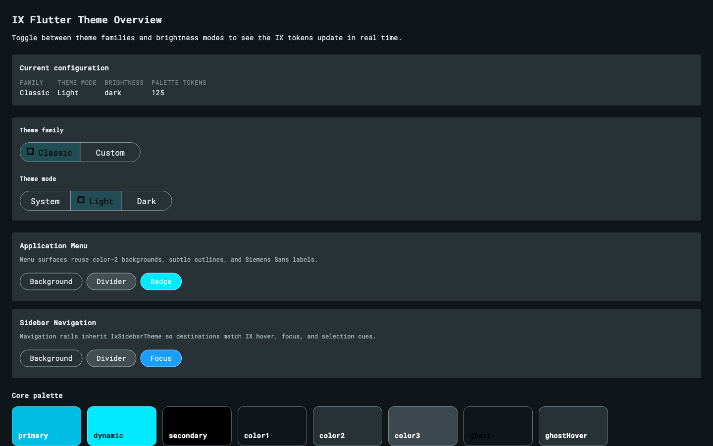
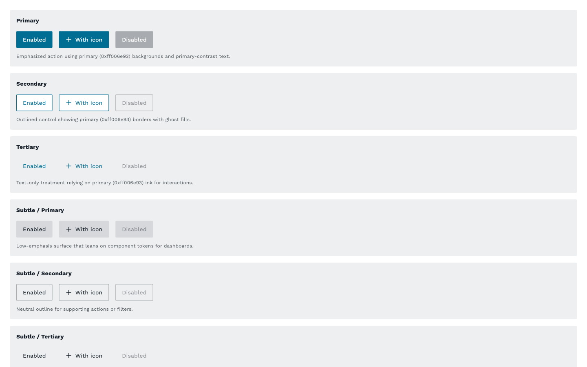

# ix_flutter

[](https://github.com/SobSoft-s-r-o/ix_flutter/actions/workflows/ci.yml)
[](https://github.com/SobSoft-s-r-o/ix_flutter/actions/workflows/version-bump.yml)
[](https://pub.dev/packages/ix_flutter)
[](https://flutter.dev)
[](https://dart.dev)
[](LICENSE)

A Flutter component library that implements the Siemens iX Design System.

> ⚠️ **Important Disclaimer**: This is an **independent, community-maintained** adaptation of the Siemens iX Design System for Flutter. It is **NOT** developed, maintained, or endorsed by Siemens AG. See [LICENSE](LICENSE), [ICON_LICENSING.md](ICON_LICENSING.md), and [THIRD_PARTY_NOTICES.md](THIRD_PARTY_NOTICES.md) for complete legal information.

## Screenshots



*Theme configuration and token overview (classic dark, bundled Work Sans typography)*



*Buttons, variants and states (classic light)*

## Overview

`ix_flutter` provides Flutter widgets and components that implement the Siemens iX Design System, enabling developers to build consistent, professional applications that follow Siemens design guidelines.

This package brings the design patterns, components, and visual language from [Siemens iX](https://ix.siemens.io) to Flutter applications.

## Features

- 🎨 **Siemens iX theme system** - `IxThemeBuilder` and `IxThemeController` for light, dark and system color schemas
- 🧩 **UI components** - application shell, breadcrumb, blind, dropdown, data view, toasts, spinner, empty state
- 🎯 **1 479 icons** - full Siemens iX icon catalogue via the optional `ix_icons_generator`
- 📱 **Responsive design** - components adapt to different screen sizes
- ♿ **Accessibility** - semantics, keyboard navigation and WCAG-sized hit areas

## Installation

Add this to your package's `pubspec.yaml` file:

```yaml
dependencies:
  ix_flutter: ^1.1.0
```

Then run:

```bash
flutter pub get
```

## Using Siemens iX icons

`ix_flutter` widgets render their own icons out of the box (falling back to Material glyphs today; see [doc/ix_icons.md](https://github.com/SobSoft-s-r-o/ix_flutter/blob/main/doc/ix_icons.md#fallback-policy)) — no generator required. The optional `ix_icons_generator` tool adds the full 1 479-icon Siemens iX catalogue to your own app.

1. Add the generator to your `pubspec.yaml`:

```yaml
dev_dependencies:
  ix_icons_generator: ^1.1.0
```

2. Generate the icons:

```bash
dart run ix_icons_generator:generate_icons            # default: @siemens/ix-icons 3.5.0
```

3. Use them in your code:

```dart
import 'package:ix_flutter/ix_flutter.dart';
import 'package:your_app/ix_icons.dart';

Widget catalogueIcon() => const IxIcon(IxIconsData.home);
```

**See [doc/ix_icons.md](https://github.com/SobSoft-s-r-o/ix_flutter/blob/main/doc/ix_icons.md) for the complete icon guide** (internal icons, fallback policy, licensing).

## Getting started

Upgrading from 1.1 toward the planned 2.0 release? Read the
[1.1-to-2.0 migration guide](https://github.com/SobSoft-s-r-o/ix_flutter/blob/main/doc/migration_1_1_to_2_0.md)
for the APIs available today and the changes that remain planned.

### 1. Build your theme

```dart
import 'package:flutter/material.dart';
import 'package:ix_flutter/ix_flutter.dart';

class MyApp extends StatelessWidget {
  const MyApp({super.key});

  @override
  Widget build(BuildContext context) {
    return MaterialApp(
      title: 'Siemens iX Demo',
      theme: const IxThemeBuilder.light().build(),
      darkTheme: const IxThemeBuilder.dark().build(),
      themeMode: ThemeMode.system,
      home: const HomeScreen(),
    );
  }
}
```

To switch themes at runtime, use `IxThemeController` — see [doc/theming.md](https://github.com/SobSoft-s-r-o/ix_flutter/blob/main/doc/theming.md).

### 2. Use iX components

Material buttons pick up the iX styling from the theme; `IxButtonTheme.style(...)` selects a Siemens iX button variant.

```dart
import 'package:flutter/material.dart';
import 'package:ix_flutter/ix_flutter.dart';
import 'package:your_app/ix_icons.dart';

class HomeScreen extends StatelessWidget {
  const HomeScreen({super.key});

  @override
  Widget build(BuildContext context) {
    final buttons = Theme.of(context).extension<IxButtonTheme>();
    return Scaffold(
      appBar: AppBar(
        title: const Text('My App'),
        leading: const IxIcon(IxIconsData.menu),
      ),
      body: Column(
        children: [
          FilledButton(
            style: buttons?.style(IxButtonVariant.primary),
            onPressed: () {},
            child: const Text('Primary Action'),
          ),
          FilledButton(
            style: buttons?.style(IxButtonVariant.secondary),
            onPressed: () {},
            child: const Text('Secondary Action'),
          ),
        ],
      ),
    );
  }
}
```

## Components

| Component | Purpose |
|---|---|
| `IxApplicationScaffold` | Application shell with a responsive, collapsible menu |
| `IxBreadcrumb` | Hierarchical navigation with overflow handling |
| `IxBlind` / `IxBlindAccordion` | Collapsible panels |
| `IxDropdownButton` | Button that opens a Siemens iX menu |
| `IxEmptyState` | Empty, error and "no results" states |
| `IxResponsiveDataView` | Table on desktop, cards on mobile, with sorting and pagination |
| `IxPaginationBar` | Standalone pagination controls |
| `IxToastService` / `IxToastOverlay` | Toast notifications |
| `IxSpinner` | Loading indicator |
| `IxIcon` / `IxIconButton` | Icon rendering and icon-only buttons |

## Documentation

The full documentation lives in the repository:

| Topic | Page |
|---|---|
| Getting started | [GETTING_STARTED.md](https://github.com/SobSoft-s-r-o/ix_flutter/blob/main/GETTING_STARTED.md) |
| API index | [API_REFERENCE.md](https://github.com/SobSoft-s-r-o/ix_flutter/blob/main/API_REFERENCE.md) |
| Themes and color schemas | [doc/theming.md](https://github.com/SobSoft-s-r-o/ix_flutter/blob/main/doc/theming.md) |
| Color tokens | [doc/tokens.md](https://github.com/SobSoft-s-r-o/ix_flutter/blob/main/doc/tokens.md) |
| Typography | [doc/typography.md](https://github.com/SobSoft-s-r-o/ix_flutter/blob/main/doc/typography.md) |
| Density and `IxIconButton` | [doc/density.md](https://github.com/SobSoft-s-r-o/ix_flutter/blob/main/doc/density.md) |
| Icons | [doc/ix_icons.md](https://github.com/SobSoft-s-r-o/ix_flutter/blob/main/doc/ix_icons.md) |
| Application scaffold | [doc/ix_application_scaffold.md](https://github.com/SobSoft-s-r-o/ix_flutter/blob/main/doc/ix_application_scaffold.md) |
| Blind | [doc/ix_blind.md](https://github.com/SobSoft-s-r-o/ix_flutter/blob/main/doc/ix_blind.md) |
| Breadcrumb | [doc/ix_breadcrumb.md](https://github.com/SobSoft-s-r-o/ix_flutter/blob/main/doc/ix_breadcrumb.md) |
| Dropdown button | [doc/ix_dropdown_button.md](https://github.com/SobSoft-s-r-o/ix_flutter/blob/main/doc/ix_dropdown_button.md) |
| Empty state | [doc/ix_empty_state.md](https://github.com/SobSoft-s-r-o/ix_flutter/blob/main/doc/ix_empty_state.md) |
| Responsive data view | [doc/ix_responsive_data_view.md](https://github.com/SobSoft-s-r-o/ix_flutter/blob/main/doc/ix_responsive_data_view.md) |
| Spinner | [doc/ix_spinner.md](https://github.com/SobSoft-s-r-o/ix_flutter/blob/main/doc/ix_spinner.md) |
| Toasts | [doc/ix_toast.md](https://github.com/SobSoft-s-r-o/ix_flutter/blob/main/doc/ix_toast.md) |
| 1.1 to 2.0 migration | [doc/migration_1_1_to_2_0.md](https://github.com/SobSoft-s-r-o/ix_flutter/blob/main/doc/migration_1_1_to_2_0.md) |

The generated Dart API reference is on
[pub.dev](https://pub.dev/documentation/ix_flutter/latest/).

## Example

A complete demo application lives in
[example/](https://github.com/SobSoft-s-r-o/ix_flutter/tree/main/example):

```bash
cd example
flutter pub get

# The example ships with pre-generated icons (example/lib/ix_icons.dart
# and its assets), so this step is optional -- run it only to
# regenerate them, e.g. against a different @siemens/ix-icons version.
# dart run ix_icons_generator:generate_icons

flutter run
```

## Icon generator tool

`ix_icons_generator` is an optional dev dependency that downloads the full Siemens iX icon catalogue (1 479 icons in the pinned `3.5.0` release) from the official `@siemens/ix-icons` npm package and generates `IxIconsData` constants for `ix_flutter`'s `IxIcon` widget.

```bash
# Basic usage
dart run ix_icons_generator:generate_icons            # default: @siemens/ix-icons 3.5.0

# Custom paths, pinned version
dart run ix_icons_generator:generate_icons --icons-version 3.5.0 -a assets/ix_icons

# For library packages
dart run ix_icons_generator:generate_icons --package my_library_name

# Show help
dart run ix_icons_generator:generate_icons --help
```

See [ix_icons_generator](https://pub.dev/packages/ix_icons_generator) for complete generator documentation.

## Platform support

| Platform | Supported |
|----------|-----------|
| Android  | ✅         |
| iOS      | ✅         |
| Web      | ✅         |
| macOS    | ✅         |
| Windows  | ✅         |
| Linux    | ✅         |

## Requirements

- Flutter SDK: >=3.38.0
- Dart SDK: >=3.10.0

CI builds and tests against the pinned Flutter 3.44.6 (stable).

## Important legal notice

### Trademark and attribution

- **Siemens iX Design System** is owned and maintained by Siemens AG
- This package is an **independent community adaptation**, not an official Siemens product
- Not developed, maintained, or endorsed by Siemens
- Siemens® and Siemens iX™ are trademarks of Siemens AG

For official Siemens iX resources, visit: https://ix.siemens.io

### Icon licensing

`@siemens/ix-icons` is MIT-licensed (Copyright (c) 2022 Siemens AG); see [UPSTREAM.md](https://github.com/SobSoft-s-r-o/ix_flutter/blob/main/UPSTREAM.md) for the exact version, tag, commit and tarball checksum:

1. Once the LEGAL REVIEW gate documented in `UPSTREAM.md` is passed, the library will bundle a minimal internal set (28 icons) required by its own widgets; until then library widgets fall back to Material glyphs through `IxIconResolver.material()`.
2. The full catalogue is optional and generated into your app from the official `@siemens/ix-icons` npm package with the `ix_icons_generator` tool.
3. Redistribution keeps the MIT copyright/permission notice and `READMEOSS.html`; Siemens trademarks and brand guidelines are separate from the MIT copyright license.

See [ICON_LICENSING.md](ICON_LICENSING.md) and [THIRD_PARTY_NOTICES.md](THIRD_PARTY_NOTICES.md) for the complete licensing information.

## License

This package is licensed under the MIT License. See [LICENSE](LICENSE) for details.

**Important**: Icons and design patterns are subject to separate licensing terms. See [ICON_LICENSING.md](ICON_LICENSING.md) for details.

## Changelog

See [CHANGELOG.md](CHANGELOG.md) for version history and updates.

## Support

- **Issues**: [Report a bug](https://github.com/SobSoft-s-r-o/ix_flutter/issues)
- **Discussions**: [Ask a question](https://github.com/SobSoft-s-r-o/ix_flutter/discussions)
- **Contributing**: [CONTRIBUTING.md](https://github.com/SobSoft-s-r-o/ix_flutter/blob/main/CONTRIBUTING.md)
- **Security**: [SECURITY.md](https://github.com/SobSoft-s-r-o/ix_flutter/blob/main/SECURITY.md)
- **Maintainer**: SobSoft (https://sobsoft.sk)

### Sponsorship

Support the development of this package! ❤️

[](https://github.com/sponsors/SobSoft-s-r-o)

Your sponsorship helps maintain and improve ix_flutter. [Become a sponsor](https://github.com/sponsors/SobSoft-s-r-o) or use the **Sponsor** button at the top of the repository.

### Commercial support

For paid support, consulting, or custom development services, contact SobSoft:

📧 **[Contact Form](https://sobsoft.sk/en/contact)**

We offer professional services including:
- Custom component development
- Migration assistance
- Integration support
- Training and consulting

---

**Community Project Notice**: This package is maintained by the community and is not affiliated with Siemens. For official Siemens iX resources, visit https://ix.siemens.io

**Disclaimer**: This is not an official Siemens product. This library is developed independently and provides Flutter implementations of Siemens iX Design System patterns. Always ensure compliance with Siemens licensing terms when using iX design assets.

---

Developed by [SobSoft](https://sobsoft.sk) – Industrial HMI & Enterprise Software Engineering
